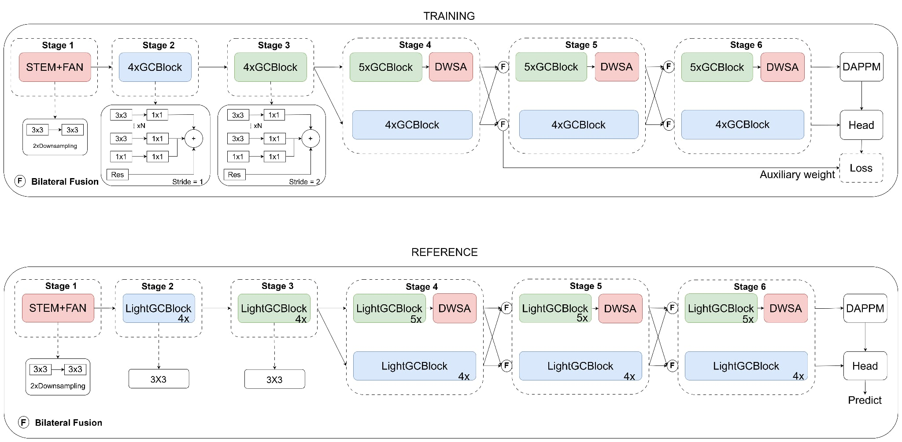
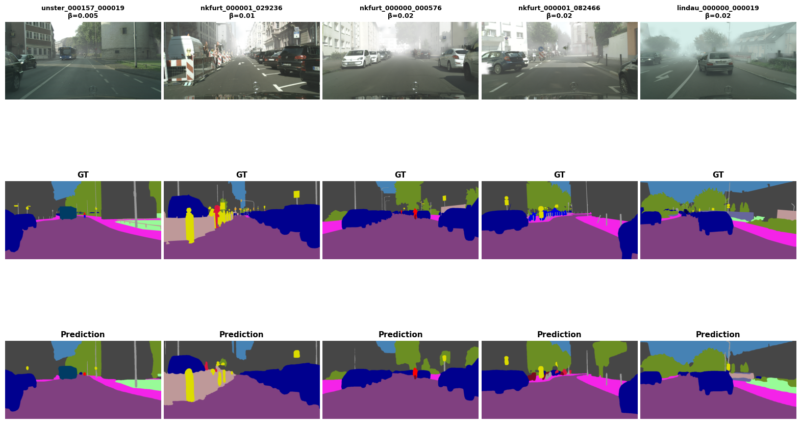
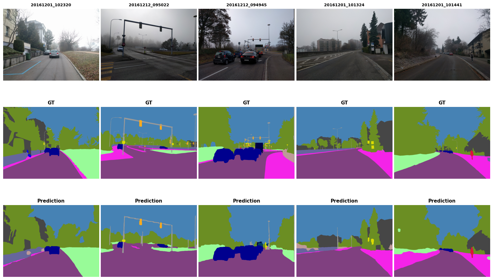

# FD-Net: Real-Time Semantic Segmentation in Foggy Weather Conditions

<div align="center">


**Official PyTorch implementation of FD-Net**  
*A lightweight fog-aware semantic segmentation framework for robust and real-time road-scene perception.*

**Giang Tuan Hung**  
Hung Yen University of Technology and Education, 2026  
Supervised by **Trung Hieu Le, PhD**

</div>

---

## Abstract

Semantic segmentation is a fundamental component of autonomous-driving perception, but its reliability degrades substantially in foggy scenes because atmospheric scattering reduces visibility, weakens object boundaries, and suppresses fine-grained visual cues. A common solution is to cascade an image-dehazing network with a semantic-segmentation model. However, improving low-level image appearance does not necessarily improve semantic understanding, and the additional restoration stage introduces substantial computational overhead.

We propose **FD-Net**, a lightweight semantic-segmentation framework built upon **GCNet** that learns fog-robust representations directly inside the segmentation network. FD-Net introduces two complementary modules: **Foggy-Aware Normalization (FAN)**, which alleviates fog-induced feature-distribution discrepancies in early layers by adaptively combining Batch Normalization and Instance Normalization, and **Dynamic Weight Self-Attention (DWSA)**, which efficiently captures long-range contextual dependencies in the semantic branch through spatially reduced self-attention and dynamic channel weighting. Experiments on **Foggy Cityscapes** and the real-world **Foggy Driving** benchmark demonstrate improved segmentation accuracy while retaining real-time inference efficiency.

---

## Highlights

- **Fog-aware feature normalization.** FAN adaptively interpolates between BN and IN in the first two stem convolutions, where fog-induced appearance shifts are most pronounced.
- **Efficient global context modeling.** DWSA introduces long-range contextual reasoning only in the semantic branch and reduces the spatial size of Q/K/V before attention computation.
- **Real-time performance.** FD-Net reaches **67.89% mIoU** on Foggy Cityscapes with **9.45M parameters** and **139 FPS** in the main inference benchmark.
- **Real-world generalization.** Without using Foggy Driving during training, FD-Net achieves **38.36% mIoU** on the 101-image real-world foggy benchmark.
- **No external dehazing network.** Fog robustness is learned directly in the segmentation model, avoiding the latency of cascaded restoration-and-segmentation pipelines.

---

## Method

FD-Net follows the lightweight dual-branch design of GCNet. The shared shallow stages extract low-level features, after which the network separates into a **Detail Branch** for high-resolution spatial information and a **Semantic Branch** for high-level contextual representation.

The proposed modifications are deliberately lightweight:

1. **FAN** replaces Batch Normalization only in `stem_conv1` and `stem_conv2`.
2. **DWSA** is inserted exclusively in the Semantic Branch at Stages 4, 5, and 6.
3. An auxiliary segmentation head is used during training and removed at inference time.

### Overall Architecture



*Overview of the proposed FD-Net architecture. The fog-aware components are introduced into the original lightweight GCNet backbone without adding a separate image-restoration stage.*

### Architecture Summary

```text
Input
  └─ Stage 1: Stem + FAN
       └─ Stage 2–3: Shared GCBlocks
            ├─ Semantic Branch
            │    ├─ Stage 4: GCBlocks + DWSA
            │    ├─ Stage 5: GCBlocks + DWSA
            │    └─ Stage 6: GCBlocks + DWSA → DAPPM
            │
            └─ Detail Branch
                 ├─ Stage 4: GCBlocks
                 ├─ Stage 5: GCBlocks
                 └─ Stage 6: GCBlocks → Segmentation Head

        ↕ bilateral feature interaction between semantic/detail branches
```

### DWSA Placement

| Module | Resolution | Channels |
|---|---:|---:|
| `dwsa_stage4` | 1/16 | 128 (C×4) |
| `dwsa_stage5` | 1/32 | 256 (C×8) |
| `dwsa_stage6` | 1/8 | 128 (C×4) |

---

## Foggy-Aware Normalization (FAN)

Foggy images with different attenuation levels can exhibit heterogeneous feature distributions. Batch Normalization depends on mini-batch statistics and may therefore be sensitive to these cross-sample variations. Instance Normalization is more robust to instance-specific appearance changes, but using it alone may remove useful globally consistent semantic information.

FAN learns a channel-wise interpolation between the two normalization schemes:

```text
FAN(x) = p · IN(x) + (1 − p) · BN(x)
p = σ(α)
```

where `α` is a learnable channel-wise parameter and `σ(·)` is the sigmoid function.

- `p → 1`: FAN approaches **Instance Normalization**.
- `p → 0`: FAN approaches **Batch Normalization**.
- Intermediate values allow the network to adapt its normalization behavior independently for different feature channels.
- FAN is used only in `stem_conv1` and `stem_conv2` to target low-level fog-sensitive features such as intensity, color, texture, and edges.

---

## Dynamic Weight Self-Attention (DWSA)

Small and distant objects in dense fog often have blurred boundaries and weak local appearance cues. To improve contextual reasoning without the cost of full-resolution self-attention, DWSA performs attention on spatially reduced query, key, and value representations.

```text
Q, K, V = Conv1×1(x)
Q', K', V' = AdaptiveAvgPool(Q, K, V)
A = Softmax(Q'ᵀK' / √dₖ)
```

The attended representation is restored to the original spatial resolution and further modulated by a content-adaptive channel gate generated from the attended features. A residual connection preserves the original representation:

```text
DWSA(x) = x + γ · Proj(Context ⊙ ChannelWeight)
```

where `Proj(·)` denotes a `1×1` projection and `γ` is a learnable residual scaling parameter.

The proposed spatial reduction decreases the attention computation by approximately **16×** relative to the unreduced formulation while preserving global contextual interactions.

---

## Training Objective

The network is trained using a combination of hard-pixel supervision, region-overlap optimization, and deep supervision:

```text
L = L_OHEM-CE + 0.5 · L_Dice + 0.4 · L_Aux-CE
```

- **OHEM Cross-Entropy** emphasizes difficult pixels.
- **Dice loss** directly optimizes region-level overlap between predictions and ground truth.
- **Auxiliary Cross-Entropy** provides additional gradients to shallow features through a training-only auxiliary head.

The auxiliary head is discarded during inference and therefore introduces **no additional deployment-time cost**.

---

# Experimental Results

## Foggy Cityscapes

| Model | mIoU | mDice | mAcc | Params | FPS |
|---|---:|---:|---:|---:|---:|
| GCNet | 0.5882 | 0.6911 | 0.7293 | 9.21M | 182.3 |
| BiSeNetV2 | 0.5721 | 0.7143 | 0.6479 | 5.23M | 76.6 |
| PIDNet | 0.5851 | 0.7251 | 0.6885 | 43.83M | 122.0 |
| SCTNet | 0.6396 | 0.7717 | 0.7328 | 12.05M | 162.1 |
| DDRNet | 0.5821 | 0.7236 | 0.6687 | 20.30M | 85.3 |
| RDRNet | 0.5946 | 0.7351 | 0.7028 | 7.30M | 75.0 |
| PSPNet | 0.5234 | 0.6516 | 0.7117 | 24.38M | 65.0 |
| **FD-Net (Ours)** | **0.6789** | **0.8074** | **0.7768** | **9.45M** | **139.0** |

FD-Net achieves **67.89% mIoU**, improving the GCNet baseline by **9.07 percentage points** while retaining real-time inference speed. Weight will be published when our paper is accepted.

## Foggy Driving: Real-World OOD Evaluation

| Model | mIoU | mDice | mAcc |
|---|---:|---:|---:|
| GCNet | 0.3042 | 0.4254 | 0.4707 |
| BiSeNetV2 | 0.3791 | 0.5123 | 0.5111 |
| PIDNet | 0.3168 | 0.4331 | 0.4494 |
| SCTNet | 0.3739 | 0.5076 | 0.5417 |
| DDRNet | 0.2707 | 0.3828 | 0.3685 |
| RDRNet | 0.3253 | 0.4401 | 0.5139 |
| PSPNet | 0.1662 | 0.2473 | 0.5567 |
| **FD-Net (Ours)** | **0.3836** | **0.5158** | **0.5586** |

Foggy Driving is not used during training. The results therefore evaluate the ability of the model to generalize from synthetic fog to unseen real-world foggy scenes.

## Comparison with Dehazing + Segmentation Pipelines

| Method | Foggy Cityscapes mIoU | Foggy Driving mIoU | FPS | Latency |
|---|---:|---:|---:|---:|
| CORUN + GCNet | 0.5940 | 0.3405 | 5 | 193 ms |
| MB-Taylorformer + GCNet | 0.6207 | 0.3349 | 8 | 118 ms |
| FFA-Net + GCNet | 0.6222 | 0.3455 | 0.2 | 5018 ms |
| **FD-Net (Ours)** | **0.6789** | **0.3836** | **139** | **7.20 ms** |

These results show that integrating fog-aware representation learning directly into the segmentation network provides a substantially better accuracy–latency trade-off than cascaded dehazing-and-segmentation pipelines.

---

## Qualitative Results

### Foggy Cityscapes



*Qualitative comparison on Foggy Cityscapes. The benchmark contains multiple fog-density levels with attenuation coefficients β = 0.005, 0.01, and 0.02.*

### Foggy Driving



*Qualitative results on the real-world Foggy Driving benchmark. The 101 Foggy Driving images are used only for evaluation and are never included in training.*

---

# Getting Started

## Installation

```bash
git clone https://github.com/your-username/fog-segmentation.git
cd fog-segmentation
pip install -r requirements.txt
```

### Requirements

```text
torch>=2.2.0
torchvision>=0.17.0
numpy>=1.23.0
opencv-python>=4.8.0
albumentations[pytorch]>=1.4.0
Pillow>=9.5.0
tqdm
```

---

## Datasets

### Foggy Cityscapes

Foggy Cityscapes is derived from Cityscapes using an atmospheric-scattering model. Three attenuation coefficients are used in the experiments:

- `β = 0.005`
- `β = 0.01`
- `β = 0.02`

The original Cityscapes split contains **2,975 training images** and **500 validation images** at `1024 × 2048` resolution. Considering the three fog-density variants gives **8,925 foggy training images** and **1,500 foggy evaluation images**.

Download the Cityscapes data from:

- [Cityscapes](https://www.cityscapes-dataset.com/)

A validation list can be stored as:

```text
/path/to/foggy_image.png,/path/to/gtFine_labelIds.png
```

### Foggy Driving

Foggy Driving contains **101 real-world foggy road scenes** with semantic annotations. It is used exclusively as an **out-of-distribution test benchmark** and is not involved in model training.

- [Foggy Driving benchmark](http://people.ee.ethz.ch/~csakarid/SFSU_synthetic/)

---

## Training

The model is initialized from GCNet weights pretrained on clean Cityscapes and fine-tuned using progressive four-stage unfreezing.

```bash
python train.py \
  --train_txt /path/to/train.txt \
  --val_txt /path/to/val.txt \
  --pretrained /path/to/gcnet_cityscapes.pth \
  --img_h 512 --img_w 1024 \
  --batch_size 4 \
  --epochs 100 \
  --lr 5e-4
```

### Training Configuration

| Setting | Value |
|---|---|
| Initialization | GCNet pretrained on clean Cityscapes |
| Optimizer | AdamW |
| Initial learning rate | `5 × 10⁻⁴` |
| Weight decay | `1 × 10⁻⁴` |
| Scheduler | Cosine annealing |
| Epochs | 100 |
| Batch size | 4 |
| Input size | `512 × 1024` |
| Augmentation | Random horizontal flip, random scaling, random crop |
| Loss | OHEM CE + 0.5 Dice + 0.4 Auxiliary CE |
| Hardware | NVIDIA Tesla P100 16 GB |
| Transfer strategy | Progressive four-stage unfreezing |

---

## Evaluation

### Foggy Cityscapes

```bash
python test.py \
  --ckpt /path/to/checkpoint.pth \
  --validate \
  --val_txt /path/to/val.txt \
  --img_h 512 --img_w 1024 \
  --batch_size 8
```

### Foggy Driving

```bash
python test.py \
  --ckpt /path/to/checkpoint.pth \
  --validate_driving \
  --driving_root /path/to/Foggy_Driving \
  --img_h 512 --img_w 1024
```

### Speed Benchmark

```bash
python test.py \
  --ckpt /path/to/checkpoint.pth \
  --benchmark \
  --img_h 512 --img_w 1024 \
  --n_warmup 50 --n_repeat 3
```

---

## Video Inference

```bash
# Overlay prediction on the input video
python test.py \
  --ckpt /path/to/checkpoint.pth \
  --infer_video \
  --video_input /path/to/video.mp4 \
  --img_h 512 --img_w 1024 \
  --video_alpha 0.55

# Save the pure semantic segmentation mask
python test.py \
  --ckpt /path/to/checkpoint.pth \
  --infer_video \
  --video_input /path/to/video.mp4 \
  --img_h 512 --img_w 1024 \
  --video_alpha 1.0 \
  --video_save_mask
```

---

# Deployment Benchmark

In addition to the main paper-style experiments, the repository includes an Edge-AI deployment benchmark on a consumer laptop GPU using different inference backends.

### Hardware

| Component | Specification |
|---|---|
| GPU | NVIDIA GeForce RTX 2050 Laptop GPU (4 GB) |
| CPU | Intel Core i5 laptop processor |
| Input resolution | 512 × 1024 |
| Model | FD-Net, 9.45M parameters |
| Batch size | 1 |

### Backend Comparison

| Backend | Precision | FPS ↑ | Latency ↓ | GPU Memory |
|---|---:|---:|---:|---:|
| PyTorch | FP32 | 60.8 | 16.45 ms | 114.3 MB |
| ONNX Runtime CUDA | FP32 | 55.7 | 17.94 ms | 42.7 MB |
| OpenVINO GPU | FP16 | 29.8 | 33.58 ms | 42.1 MB |
| TensorRT | FP32 | 100.9 | 9.92 ms | 42.7 MB |
| **TensorRT** | **FP16** | **203.4** | **4.92 ms** | **45.4 MB** |

The TensorRT FP16 configuration provides the highest measured throughput in this repository-level deployment benchmark.

---

## Citation

If you use this code or build upon FD-Net in your research, please cite the accompanying manuscript:

```bibtex
@misc{giang2026fdnet,
  title  = {FD-Net: Real-Time Semantic Segmentation in Foggy Weather Conditions},
  author = {Giang, Tuan Hung},
  year   = {2026},
  note   = {Manuscript}
}
```

> The BibTeX entry should be updated to the final journal/conference metadata after publication.

---

## Acknowledgements

This work builds upon and is inspired by the following projects and research directions:

- [GCNet](https://arxiv.org/abs/2503.03325) — baseline real-time semantic segmentation architecture.
- [Foggy Cityscapes / Semantic Foggy Scene Understanding](http://people.ee.ethz.ch/~csakarid/SFSU_synthetic/) — synthetic and real-world foggy-scene benchmarks.
- [Cityscapes](https://www.cityscapes-dataset.com/) — urban-scene semantic segmentation dataset.
- [Non-local Networks](https://arxiv.org/abs/1711.07971), [PVT](https://arxiv.org/abs/2102.12122), and [SENet](https://arxiv.org/abs/1709.01507) — contextual and channel-attention foundations related to the DWSA design.

---

## License

This repository is released under the **MIT License**. See `LICENSE` for details.

---

<div align="center">

If this repository is useful for your research, please consider citing the work and starring the repository.

</div>
